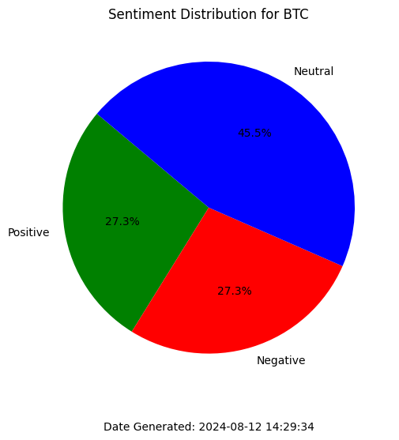

# Project Overview
- This project uses NLP and web scrapping to perform sentiment analysis on ticker symbols
- Graphs and excel sheets can be generated based on the data gathered for better visualizaion

# Models used
```python
tokenizer = AutoTokenizer.from_pretrained("human-centered-summarization/financial-summarization-pegasus")
```
**Type:** Tokenizer
- **Purpose:** Tokenization is the process of breaking down text into smaller units (tokens) like words or sub words that the model can understand. The tokenizer is crucial because it converts raw text into a numerical format that the model can process.

- **Model Used:** The tokenizer is based on the **PEGASUS** model, specifically fine-tuned for **financial summarization**. The tokenizer knows how to break down text in a way that is optimized for the PEGASUS model's architecture and pretraining.
```python
summarizer = TFAutoModelForSeq2SeqLM.from_pretrained("human-centered-summarization/financial-summarization-pegasus")
```
**Type:** Seq2Seq Language Model
- **Purpose**: This model is responsible for summarizing financial text. It takes the tokenized input and generates a summary that captures the key points

- **Model Used**: The model is based on **PEGASUS**, which stands for "Pre-training with Extracted Gap-sentences for Abstractive Summarization." PEGASUS is a transformer model designed for summarization tasks and has been fine-tuned on financial data for this specific variant.

```python
sentiment = pipeline("sentiment-analysis", model="yiyanghkust/finbert-tone")
```
**Type:** Sentiment Analysis Model
- **Purpose**: Sentiment analysis involves determining the emotional tone behind a body of text, classifying it as positive, negative, or neutral. This is particularly useful in financial contexts where the sentiment expressed in news articles, reports, or social media can influence market movements.

- **Model Used**: The model in use is **FinBERT**, a BERT (Bidirectional Encoder Representations from Transformers) model fine-tuned on financial data. The specific variant used here, **"yiyanghkust/finbert-tone"**, is tailored to detect sentiment in financial texts.

# Methods
- The three main methods are `search_for_news_urls`, `filter`, `scrape` and `summarize`
- `search_for_news_urls` Searches for news articles related to the ticker
- `filter` Cleans up the found URLs
- `scrape` Extracts the content in the flitered URLs
- `summarize` Summarizes the scraped content

## Searching for news articles
```python
def search_for_news_urls(t):
    search_url="https://www.google.com/searchq=yahoo+finance{}&tbm=nws".format()
    r = requests.get(search_url)
    soup = BeautifulSoup(r.text, 'html.parser')
    a_tags = soup.find_all('a')
    hrefs = [link['href'] for link in a_tags]
    return hrefs
```
- Function takes in a single parameter `t`, which represents a stock ticker symbol

```python
search_url = "https://www.google.com/search?q=yahoo+finance+{}&tbm=nws".format(t)
```
- This constructs a Google search URL for news articles related to the given ticker symbol `t`. The URL is formatted to include the ticker symbol in the search query and specifies the `tbm=nws` parameter to search specifically for news articles.

```python
r = requests.get(search_url)
```
- This sends an HTTP GET request to the constructed search URL using the requests library and stores the response in the variable `r`.

```python
soup = BeautifulSoup(r.text, 'html.parser')
```
- This parses the HTML content of the response using `BeautifulSoup` from the bs4 library. The `html.parser` argument specifies the parser to be used.

```python
a_tags = soup.find_all('a')
```
- This finds all the anchor (`<a>`) tags in the parsed HTML content. Anchor tags typically contain hyperlinks.

```python
hrefs = [link['href'] for link in a_tags]
```
- This extracts the `href` attribute (which contains the URL) from each anchor tag and stores them in a list called `hrefs`.

## Cleaning up URLs
```python
exclude = ['maps', 'policies', 'preferences', 'accounts', 'support']
def filter(urls, excludeList):
    val = []
    for url in urls:
        if 'https://' in url and not any(word in url for word in excludeList):
            res = re.findall(r'(https?://\S+)', url)[0].split('&')[0]
            val.append(res)
    return list(set(val))
```
- Function takes two parameters. `urls`(URLs to filter) and `excludeList`(a list of words to exclude)
- Ensures that only unique and cleaned URLs are returned

```python
excludeList = ['maps', 'policies', 'preferences', 'accounts', 'support']
```
- Defines a list of words to exclude
- URLs containing any of these words will be excluded

```python
if 'https://' in url and not any(word in url for word in excludeList):
```
- This checks if the URL contains 'https://' and does not contain any word from the `excludeList`. If both conditions are met, the code inside the if block is executed.

```python
res = re.findall(r'(https?://\S+)', url)[0].split('&')[0]
```
- This uses a regular expression to find the first occurrence of a URL pattern (https?://\S+) in the string `url`
- The `re.findall` function returns a list of matches, and `[0]` gets the first match. The `split('&')[0]` part splits the URL at the first occurrence of '&' and takes the first part, effectively removing any query parameters.

## Scraping URLs
```python
import time
import random

def scrape(urls):
    articles = []
    header = {'User-Agent': 'Mozilla/5.0 (Windows NT 10.0; Win64; x64) AppleWebKit/537.36 (KHTML, like Gecko) Chrome/58.0.3029.110 Safari/537.3'}

    for url in urls:
        time.sleep(random.randint(1, 5)) 
        r = requests.get(url, headers=header)
        soup = BeautifulSoup(r.text, 'html.parser')
        para = soup.find_all ('p')
        text = [paragraph.text for paragraph in para]
        words = ' '.join(text).split(' ')[:350]
        article = ' '.join(words)
        articles.append(article)
    return articles
```
- This function performs web scraping on the URLs given
- Extracts the first 350 words (can be changed) from each article and returns them as a list of strings

**Looping Through URLs**
```python
for url in urls:
    time.sleep(random.randint(1, 5))
    r = requests.get(url, headers=header)
    soup = BeautifulSoup(r.text, 'html.parser')
```
- Loops through each URL in the `urls` list.
- Introduces a random delay between 1 to 5 seconds to avoid being blocked by the server.
- Makes an HTTP GET request to the URL with the specified headers.
- Parses the HTML content of the response using `BeautifulSoup`.

**Extracting Paragraphs**
```python
para = soup.find_all('p')
text = [paragraph.text for paragraph in para]
```
- Finds all `<p>` (paragraph) tags in the HTML content.
- Extracts the text from each paragraph tag and stores it in a list test

**Process Text**
```python
words = ' '.join(text).split(' ')[:350]
article = ' '.join(words)
articles.append(article)
```
- Joins the list of paragraph texts into a single string and splits it into words.
- Takes the first 350 words of the article.
- Joins these words back into a single string article
- Appends the article to the articles list

## Summarizing the articles
```python
def summarize(art, batch_size):
    summaries = []
    for i in range(0, len(art), batch_size):
        batch = art[i:i + batch_size]
        input_ids = tokenizer(batch, return_tensors='tf', padding=True, truncation=True).input_ids
        output = summarizer.generate(input_ids, max_length=55, num_beams=5, early_stopping=True)
        batch_summaries = [tokenizer.decode(ids, skip_special_tokens=True) for ids in output]
        summaries.extend(batch_summaries)
    return summaries
```
- This function processes a list of articles in batches, tokenizes them and generates summaries using a the pre-trained models.
- Once done, it decodes the summaries and returns the list of summaries

# Example of generated results
